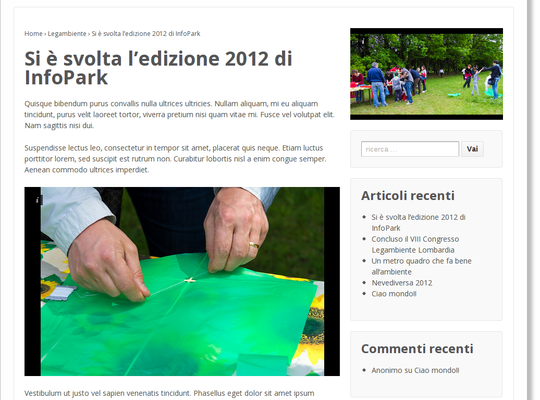

=================================================
CMS Circoli Legambiente Lombardia - Guida utente
=================================================

Introduzione
============

Gestione contenuti
==================

Articoli
---------

Eventi
-------

Media
------

Pagine
-------

Commenti
---------

CF7 - Moduli di contatto
-------------------------

Album fotografici
------------------

L'album fotografico rappresenta un **gruppo di foto** selezionate dalla ``Libreria Media``, oppure un set di flickr.com o un album di picasaweb.com, che possono essere pubblicate in un articolo o in una pagina.

   Esempio di album fotografico inserito nel corpo di un articolo e come album in evidenza.

Utilizzando foto dalla ``Libreria Media``, i campi ``titolo`` e
la ``Descrizione`` dell'immagine vengono inseriti nelle informazioni aggiuntive [#]_ di ciascuna slide dell'album, utilizzando foto pubblicate su flickr.com o su picasaweb.com il titolo della foto - se disponibile - viene inserito nelle informazioni aggiuntive.

.. [#] visualizzabili dagli utenti quando si preme la ``i`` presente in alto a sinistra nelle immagini

Album fotografico in evidenza
...............................

È possibile aggiungere un album fotografico "in evidenza" a ciascuna
pagina o articolo, selezionandolo tra quelli disponibili nel menu
a tendina "Album in evidenza" in fondo alla pagina di gestione del
contenuto. Questo album viene automaticamente visualizzato nella
colonna di destra della pagina o dell'articolo.

Shortcode per l'album fotografico
..................................

È possibile inserire uno o più album fotografici nell'area
di contenuto principale di una pagina o di un articolo, utilizzando uno **shortcode**.

Lo shortcode è ::

 [la_album id=<id_album>]
 
Per indicare quale album
visualizzare è necessario utilizzare il parametro **id**. Ad esempio,
per inserire in un articolo l'album con Permalink 'agricoltura',
basterà aggiungere questo shortcode::

  [la_album id='agricoltura']

Raccolta notizie
-----------------

Raccolta pagine
----------------

Video
------

Petizioni
---------

Ulteriore documentazione
=========================

http://en.support.wordpress.com/

