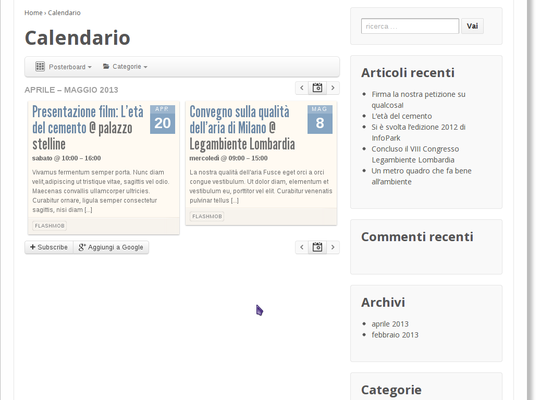
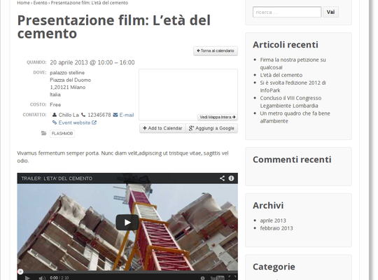
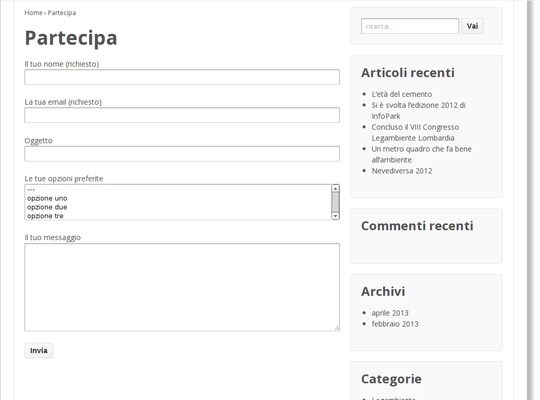
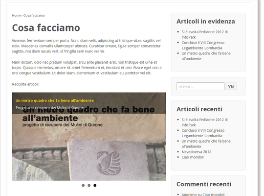
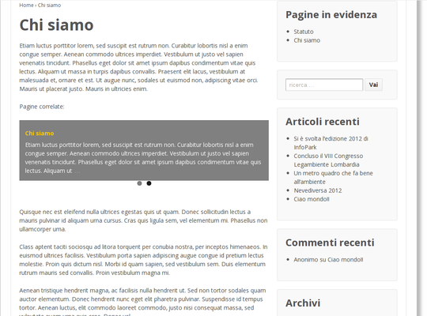
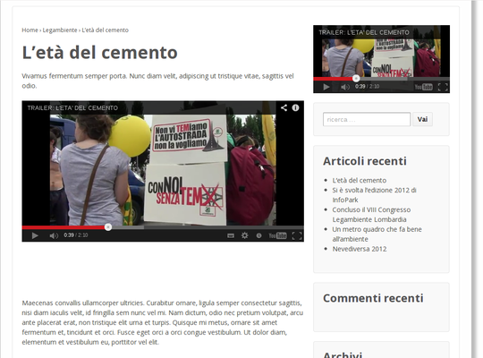
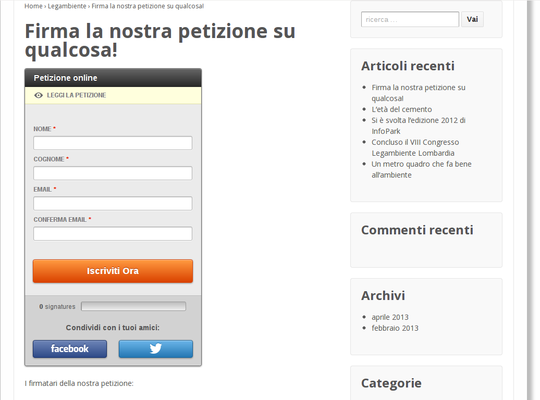

=================================================
CMS Circoli Legambiente Lombardia - Guida utente
=================================================

:author:    Giovanni Biscuolo e Andrea Rota
:address:   Giovanni Biscuolo <g@xelera.eu>, Andrea Rota <a@xelera.eu>
:revision:  1.1
:date:      2013.05.09
:copyright: Copyright © 2013 Semantica di Giovanni Biscuolo.

.. sectnum::    :depth: 4

.. contents::   :depth: 4

Introduzione
============

Il CMS per circoli di Legambiente Lombardia utilizza WordPress per la pubblicazione dei contenuti.

Questa guida non intende essere un manuale utente completo di WordPress ma la guida specifica per gestire i contenuti e le funzioni appositamente sviluppati da Xelera per questo CMS.

Alcuni dei termini tecnici utilizzati in questa guida sono definiti nel `Glossario`_

.. glossario completo in inglese https://codex.wordpress.org/Glossary

Guida in linea
---------------

Trovate la guida in linea - ove disponibile - premendo sul link ``Aiuto`` posto in alto a destra.

.. ATTENTION::
   Non tutta la guida in linea è stata tradotta in italiano dagli sviluppatori di WordPress e per alcune pagine dell'interfaccia di gestione del sito è disponibile solo in lingua inglese.

Impostazioni schermo
---------------------

Per alcuni contenuti, quali ad esempio gli ``Articoli``, è possibile personalizzare il tipo di informazioni disponibili nelle schermate di amministrazione, quali ad esempio ``Riassunto`` o ``Immagine in evidenza`` nel caso di un ``Articolo``.

Ove disponibile trovate la funzione ``Impostazioni schermo`` in alto a destra.

.. ATTENTION::
   Nel caso non vengano visualizzate alcune sezioni nell'interfaccia amministrativa occorre verificare le ``Impostazioni schermo``.

Ambiente di lavoro
===================

Profilo utente
---------------

La pagina ``Profilo`` permette di impostare alcune preferenze dell'interfaccia di WordPress e le informazioni relative al proprio utente. Per questa pagina è disponibile la `Guida in linea`_.

.. Ruoli utenti
.. .............
..
.. (e roba specifica tipo niente gestione categorie, solo tag)

Gestione contenuti standard
============================

Per i tipi di contenuto standard di WordPress ``Articoli``, ``Pagine``, ``Media`` e ``Commenti`` è disponibile la `Guida in linea`_.

Articoli e pagine
------------------

Sezione ``More Fields``
.........................

Nella sezione ``More Fields`` di ``Articoli`` e ``Pagine``, che trovate in fondo alla pagina, è possibile aggiungere uno di questi contenuti speciali:

* ``Video in evidenza``: paragrafo `Video`_

* ``Album in evidenza``: paragrafo `Album fotografici`_

* ``Rassegna articoli``: paragrafo `Raccolta notizie`_

* ``Rassegna pagine``: paragrafo `Raccolta pagine`_

.. ATTENTION::
   Verificate che la visualizzazione di ``More fields`` sia correttamente impostata in `Impostazioni schermo`_.

Media
------

La ``Libreria media`` di WordPress è utilizzata per gestire tutte le immagini inserite in pagine o notizie, nonché gli archivi di documenti quali PDF utilizzati nel sito.

È possibile caricare nella ``Libreria media`` documenti con dimensione massima 10MB (megabytes). Lo spazio totale disponibile per l'intera ``Libreria media`` è di 100MB.

Mettendo a disposizione files (ad es. documenti PDF) per i visitatori del sito, è sempre buona pratica considerare che alcuni utenti potrebbero visitare il sito da dispositivi quali smartphones collegati a velocità relativamente basse ad Internet, oppure con limiti alla quantità di dati scaricabili.

In generale, per evitare di rendere lenta la navigazione delle pagine del sito, è consigliabile utilizzare solo immagini in formato JPEG, PNG o GIF ritagliate alla dimensione desiderata tramite un programma di elaborazione di immagini e salvate con un livello di compressione/qualità adeguato a garantire una visualizzazione senza perdita di qualità, limitando il più possibile al tempo stesso la dimensione dei files delle immagini.

Immagini in evidenza
......................

Le immagini utilizzate come ``immagini in evidenza`` devono avere dimensione di 560 x 320 pixel.

Gestione contenuti speciali
===========================

Eventi
-------

Questa funzione permette di gestire gli eventi e di pubblicarli nel calendario.

   Esempio di calendario in modalità ``Pasteboard``

Un ``Evento`` è un documento del tutto simile ad un ``Articolo`` con la differenza che è possibile specificare: data e orario, luogo, costo di partecipazione e link per acquisto biglietti, contatti.

   Esempio di evento con un video incorporato (`embedded`).

Questa funzione viene fornita dall'estensione `All-In-One Event Calendar`_ di Timely_. Per la documentazione completa dell'estensione è disponibile la `documentazione di Timely`_ (solo in inglese).

.. _`All-In-One Event Calendar`: http://wordpress.org/extend/plugins/all-in-one-event-calendar/
.. _Timely: http://time.ly/
.. _`documentazione di Timely`: http://help.time.ly/

Inserire eventi in ``Articolo`` o ``Pagina``
.............................................

È possibile inserire i riferimenti al calendario eventi [#]_ - eventualmente filtrati per ``categoria evento``, ``tag evento`` o ``id evento`` - utilizzando uno degli `shortcode calendario`_ disponibili.

.. _`shortcode calendario`: http://help.time.ly/customer/portal/articles/530440-what-shortcodes-are-available-

Per esempio per inserire il calendario in modalità di visualizzazione ``agenda`` occorre inserire il seguente shortcode::

  [ai1ec view="agenda"]

per un singolo evento identificato con ``id 1``::

  [ai1ec post_id="1"]

.. [#] nella modalità di visualizzazione desiderata

Iscrizione ad altri calendari
..............................

Attraverso la funzione ``Feed del Calendario`` è possibile collegare il proprio calendario a un calendario esterno pubblicato in formato ``ICS`` [#]_ o a un ``Feed Facebook``. Per entrambe le funzioni seguire le indicazioni fornite.

.. ATTENTION::
   Xelera consiglia di memorizzare gli eventi all'interno del CMS: ciò consente un maggior controllo delle informazioni associate all'evento.

.. [#] ad es. Google Calendar

CF7 - Moduli di contatto
-------------------------

Questa funzione permette di raccogliere informazioni dagli utenti che visitano una ``Pagina`` o un ``Articolo`` attraverso appositi moduli.

   Esempio di modulo di contatto inserito in una pagina.

Le informazioni raccolte sono inviate via email ad uno o più indirizzi definiti per ciascun modulo.

Questa funzione viene fornita da una estensione di WordPress, ``Contact Form 7``, la cui documentazione completa - in inglese - è disponibile al link ``Documentazione`` in alto a destra, nella relativa sezione.

Inserimento del modulo di contatto
....................................

Il modulo di contatto può essere inserito in una ``Pagina`` o in un ``Articolo`` utilizzando lo *shortcode* ad esso associato: lo *shortcode* è visualizzato sia nell'elenco modulo che in testa alla pagina di ciascun modulo.

Esempio di shortcode::

  [contact-form-7 id="71" title="Modulo di contatto 1"]

Definizione del modulo di contatto
...................................

Il modulo di contatto viene definito nella sezione ``Modulo`` attraverso la compilazione di codice HTML *facilitato*. I campi da raccogliere sono definiti attraverso uno speciale ``tag`` [#]_ che viene generato premendo l'apposito pulsante ``Genera tag``, è possibile personalizzare la definizione del tipo di campo da inserire nel modulo.

Il ``codice tag`` generato, indicato chiaramente nella relativa sezione, deve quindi essere copiato nel codice HTML facilitato del modulo.

.. ATTENTION::
   Prendere nota o copiare nella sezione ``Mail`` il codice per il campo email

.. sarebbe utile capcha ma manca il necessario plugin

Al termine del codice HTML facilitato non deve mancare un tasto per inviare le informazioni.

.. _`esempio di modulo`:

Un esempio di modulo di contatto, che potete usare come modello, è il seguente::

  
Il tuo nome (richiesto) 
    [text* your-name] 

  
La tua email (richiesto) 
  [email* your-email] 

  
Oggetto 
    [text your-subject] 

  
Le tue opzioni preferite (possibile scelta multipla) 
    [select menu-578 multiple "uno" "due" "tre"] 

  
Il tuo messaggio 
    [textarea your-message] 

  
[submit "Invia"]

.. [#] da non confondere con il tag di un ``Articolo``

Definizione invio email
........................

Le informazioni raccolte attraverso il modulo sono inviate via email ad uno o più contatti definiti nella sezione ``Mail``.

Occorre impostare le intestazioni email ``A:``, ``Da:``, ``Oggetto:`` e il corpo del messaggio email da inviare. Il corpo del messaggio è definito attraverso un modello, in cui possono essere inseriti i codici ``tag per email`` creati nella fase di `Definizione del modulo di contatto`_.

.. ATTENTION::
   Il codice tag per l'email può essere facilmente ricostruito dal modulo di definizione testo. Ad es. se il ``codice tag`` nel modulo è definito come ``[text oggetto-email]``, il ``codice tag`` per l'email è ``[oggetto-email]``

È possibile utilizzare codice HTML per la definizione del copro dell'email, in questo caso occorre selezionare l'opzione ``Utilizza contenuti in HTML``.

Un esempio di corpo dell'email corrispondente all'`esempio di modulo`_ definito sopra - che potete usare come modello **adattandolo** alla definizione del modulo - è il seguente:

::

 Nome: [your-name]
 Email: [your-email]
 Oggetto: [your-subject]

 Scelte utente:
 [menu-578]

 Corpo del messaggio:
 [your-message]

 --
 Email inviata tramite "Modulo di contatto 1"
 CircoloZero http://circolozero.wpmu.xelera.eu

Album fotografici
------------------

L'album fotografico rappresenta un **gruppo di foto** che possono essere pubblicate in un ``Articolo`` o ``Pagina``. 

.. figure:: images/medium/post-photoalbum-view.png
   :target: images/post-photoalbum-view.png
   :scale: 100 %
   :align: center
   :alt: Album fotografico in un articolo

   Esempio di album fotografico inserito in un articolo e come album in evidenza.

Le foto nell'album possono essere selezionate da una e una sola di queste fonti [#]_:

#. ``Libreria Media``
#. set di flickr.com 
#. album di picasaweb.com

Le informazioni aggiuntive [#]_ di ciascuna immagine sono prese da ``Titolo`` e ``Descrizione``, nel caso si utilizzino immagini nella ``Libreria Media``, oppure dal titolo della foto - se disponibile - nel caso si utilizzino le altre fonti.

.. [#] nel caso fossero indicate più fonti verrà scelta la prima inserita 
.. [#] visualizzabili quando si preme l'icona ``i`` in alto a sinistra

Album fotografico in evidenza
...............................

L'album fotografico in evidenza viene automaticamente visualizzato nella
colonna di destra (``sidebar``).

Album fotografico inserito nel contenuto
.........................................

È possibile inserire uno o più album fotografici utilizzando il seguente **shortcode**::

 [la_album id='<permalink_album>']
 
Ad esempio, per inserire l'album con permalink `agricoltura`, basterà aggiungere questo shortcode::

  [la_album id='agricoltura']

Raccolta notizie
-----------------

La raccolta notizie rappresenta un **gruppo di articoli** che possono essere associati a un articolo o a una pagina.  Le notizie possono essere selezionate tra gli ``Articoli`` pubblicati.

.. .. [#] visualizzate in modalità ``Raccolta in evidenza``

   Esempio di raccolta notizie (articoli) inserita nel corpo di una pagina e
   come raccolta notizie in evidenza.

Raccolta notizie in evidenza
.............................

La raccolta notizie in evidenza viene automaticamente visualizzata come elenco nella colonna di destra (``sidebar``).

Raccolta notizie inserita nel contenuto
........................................

È possibile inserire una o più raccolte notizie all'interno del contenuto di una pagina o di un articolo utilizzando il seguente **shortcode**::

 [la_raccolta_articoli id='<permalink_raccolta_articoli>']

Le informazioni visualizzate per ciascun articolo sono prese da ``Titolo`` e ``Riassunto`` o, quando il riassunto è vuoto, dalle prime 40 parole del primo paragrafo.

Raccolta pagine
----------------

La raccolta pagine rappresenta un **gruppo di pagine** che possono essere associate a un articolo o a una pagina. Le pagine possono essere selezionate tra quelle pubblicate.

   Esempio di raccolta pagine inserita in una pagina e come raccolta
   pagine in evidenza.

Raccolta pagine in evidenza
............................

La raccolta pagine in evidenza viene automaticamente visualizzata come elenco nella colonna di destra (``sidebar``).

Raccolta pagine inserita nel contenuto
.......................................

È possibile inserire una o più raccolte pagine all'interno del contenuto di una pagina o di un articolo utilizzando il seguente **shortcode**::

 [la_raccolta_pagine id='<permalink_raccolta_pagine>']

Le informazioni visualizzate per ciascuna pagine sono prese da ``Titolo`` e ``Riassunto`` o, quando il riassunto è vuoto, dalle prime 40 parole del primo paragrafo.

Video
------

Per incorporare un video all'interno di altri contenuti occorre definire questo documento.

   Esempio di video inserito (embedded) in un articolo e come video
   in evidenza.

Il video essere selezionato da una e una sola di queste fonti [#]_:

#. YouTube
#. Vimeo
#. qualsiasi video pubblicato sul web in formato WebM_

.. [#] nel caso fossero indicate più fonti verrà scelta la prima inserita
.. _WebM: https://it.wikipedia.org/wiki/WebM

Video in evidenza
..................

Il video in evidenza viene automaticamente visualizzato nella colonna di destra (``sidebar``).

Video inseriti nel contenuto
.............................

È possibile inserire uno o più album fotografici all'interno del contenuto di una pagina o di un articolo, utilizzando il seguente **shortcode**::

 [la_video id='<permalink_video>']

Ad esempio, per inserire il con permalink 'festa2012', basterà aggiungere questo shortcode::

  [la_video id='festa2012']

Petizioni
----------

Questa funzione permette di creare petizioni online che possono essere successivamente inserite in un ``Articolo`` o una ``Pagina``.

   Esempio di petizione inserita un articolo

Le petizioni possono essere utilizzate per inviare ad uno o più destinatari un messaggio email - uno per ogni sottoscrizione effettuata - contenente il testo della petizione.

In alternativa l'invio della petizione per email può essere disabilitato e la petizione utilizzata solo ai fini della raccolta firme.

Per la gestione delle petizioni è disponibile la `Guida in linea`_ in italiano.

Petizioni inserite nel contenuto
.................................

È possibile inserire una petizione in un ``Articolo`` o in una ``Pagina`` utilizzando il seguente ``shortcode``::

  [emailpetition id="<id_petizione>"]

È possibile inserire l'elenco dei sottoscrittori della petizione in un ``Articolo`` o in una ``Pagina`` utilizzando il seguente ``shortcode``::

  [signaturelist id="<id_petizione>"]

Gli shortcode delle petizioni sono indicati nell'elenco delle petizioni.

.. Ulteriore documentazione
.. =========================

.. da valutare ma adesso non ci ho tempo

.. https://codex.wordpress.org è solo in EN ed è un mare magnum nel quale gli utenti utilizzatori si perderebbero

.. https://codex.wordpress.org/Working_with_WordPress è un lago magnum dove gli utilizzatori si perderebbero

.. https://codex.wordpress.org/WordPress_Lessons potrebbe andare ma è solo in EN e forse alcune cose sono outdated tipo i post formats https://codex.wordpress.org/Post_Formats che oggi si chiamano Layout se non sbaglio

..
.. http://en.support.wordpress.com/ : solo in inglese (e potrebbero anche farsela andare bene nel 2013) e orientata principalmente a wordpress.com

.. http://www.html.it/guide/guida-wordpress/ : in italiano ma per una versione vecchia come il cucco, e.g. vedi questo: http://www.html.it/pag/17318/scrivere-un-post-per-il-blog/

.. http://tutorial.altervista.org/wordpress/guida/ le varie pagine che ho visitato a caso sono aggiornate ad Aprile 2011, inoltre mi pare un po' troppo generico nella descrizione delle operazioni e di contro molto orientato a altervista (giustamente)

.. insomma quello della documentazione è - come sempre - un ginepraio nel quale gli sviluppatori si infilano bellamente... zio 'gnorante

Glossario
=========

CMS
  è acronimo di ``Content Management System`` cioè un sistema per la gestione dei contenuti. WordPress è un tipo di CMS.

permalink
  è un acronimo per ``permanent link`` ovvero ``link permanente``. Questo significa che qualsiasi tipo di contenuto (``Articolo``, ``Pagina``, ecc.) verrà univocamente identificato all'interno di WordPress e sul web attraverso il suo ``permalink``. Il ``permalink`` viene automaticamente generato e se necessario può essere modificato.

shortcode
  ove definito, è un codice attraverso il quale alcuni contenuti speciali possono essere inseriti nel corpo degli ``Articoli`` o delle ``Pagine``; esempio di shortcode: ``[la_album id='agricoltura']``. Nel caso la sintassi con il quale è inserito fosse errata, lo shortcode viene ignorato.

